# Comprehensive Guide to Elasticsearch Mapping

> Practical guide for designing Elasticsearch mappings, index settings, templates, and Node.js index operations.
>
> Target audience: application developers who need predictable search behavior, safe schema evolution, and production-ready index management.
>
> Examples use the typeless Elasticsearch API style used by modern Elasticsearch versions and the official Node.js client `@elastic/elasticsearch`.

---

## Table of Contents

1. [What Is Mapping?](#1-what-is-mapping)
2. [Mapping vs Settings vs Templates](#2-mapping-vs-settings-vs-templates)
3. [Mapping Lifecycle](#3-mapping-lifecycle)
4. [Core Field Types](#4-core-field-types)
5. [Text, Keyword, and Multi-fields](#5-text-keyword-and-multi-fields)
6. [Index Analysis Settings](#6-index-analysis-settings)
7. [Dynamic Mapping](#7-dynamic-mapping)
8. [Dynamic Templates](#8-dynamic-templates)
9. [Objects, Nested, Flattened](#9-objects-nested-flattened)
10. [Geo, IP, Date, Range, Completion, Vector](#10-geo-ip-date-range-completion-vector)
11. [Common Mapping Parameters](#11-common-mapping-parameters)
12. [Index Templates and Component Templates](#12-index-templates-and-component-templates)
13. [Aliases, Reindexing, and Zero-downtime Migration](#13-aliases-reindexing-and-zero-downtime-migration)
14. [Full Example: Real Estate Property Search Index](#14-full-example-real-estate-property-search-index)
15. [Node.js: Managing Indices](#15-nodejs-managing-indices)
16. [Node.js: Indexing and Searching Documents](#16-nodejs-indexing-and-searching-documents)
17. [Testing Mappings and Analyzers](#17-testing-mappings-and-analyzers)
18. [Production Checklist](#18-production-checklist)
19. [Common Mistakes](#19-common-mistakes)
20. [References](#20-references)

---

## 1. What Is Mapping?

In Elasticsearch, a **mapping** is the schema definition for documents in an index.

It tells Elasticsearch:

- which fields exist;
- each field's type;
- how text is analyzed;
- whether a field is searchable;
- whether a field can be used for sorting or aggregation;
- how objects, arrays, vectors, geo fields, and dates should be indexed.

A relational database table might look like this:

```sql
CREATE TABLE properties (
  id BIGINT PRIMARY KEY,
  title VARCHAR(255),
  price BIGINT,
  created_at DATETIME
);
```

A similar Elasticsearch mapping might look like this:

```json
PUT properties-v1
{
  "mappings": {
    "dynamic": "strict",
    "properties": {
      "id": { "type": "keyword" },
      "title": {
        "type": "text",
        "fields": {
          "keyword": { "type": "keyword", "ignore_above": 256 }
        }
      },
      "price": { "type": "long" },
      "created_at": { "type": "date" }
    }
  }
}
```

### Key idea

Mapping is not just about storage. It directly affects search behavior.

For example:

- `text` is for full-text search.
- `keyword` is for exact match, filtering, sorting, and aggregations.
- `long`, `double`, `scaled_float` are for numeric filtering and sorting.
- `geo_point` is for map and distance queries.
- `dense_vector` is for vector similarity search.

---

## 2. Mapping vs Settings vs Templates

### Mapping

Mapping defines fields and how they are indexed.

```json
{
  "mappings": {
    "properties": {
      "title": { "type": "text" },
      "status": { "type": "keyword" }
    }
  }
}
```

### Settings

Settings define index-level behavior such as shards, replicas, refresh interval, and custom analyzers.

```json
{
  "settings": {
    "number_of_shards": 1,
    "number_of_replicas": 1,
    "refresh_interval": "1s"
  }
}
```

### Templates

Templates automatically apply settings, mappings, and aliases when matching indices are created.

```json
PUT _index_template/properties-template
{
  "index_patterns": ["properties-*"] ,
  "priority": 100,
  "template": {
    "settings": {
      "number_of_shards": 1
    },
    "mappings": {
      "properties": {
        "id": { "type": "keyword" }
      }
    },
    "aliases": {
      "properties-read": {}
    }
  }
}
```

### Mermaid: relationship between settings, mapping, and templates

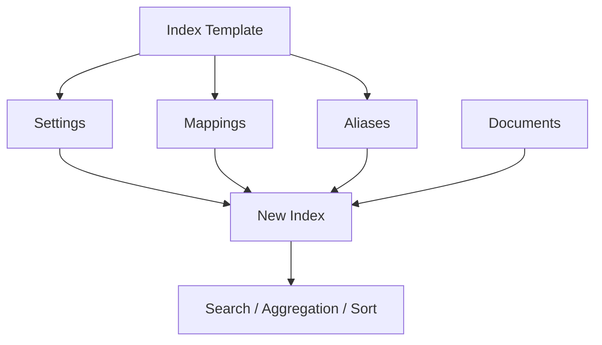

---

## 3. Mapping Lifecycle

A good production workflow is:

1. design the mapping before indexing data;
2. create index or index template;
3. index sample documents;
4. test `_analyze`, queries, sorting, and aggregations;
5. only then index full production data;
6. if a field type must change later, create a new index and reindex.

### Important limitation

In most cases, you **cannot change the type of an existing mapped field**. For example, changing `price` from `keyword` to `long` requires creating a new index and reindexing data.

You can usually add new fields, add properties to object fields, enable multi-fields in supported cases, and update only certain mapping parameters.

### Mermaid: mapping lifecycle

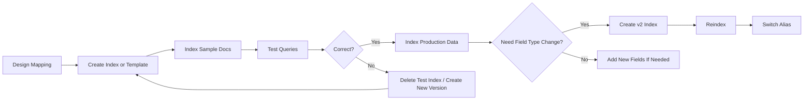

---

## 4. Core Field Types

### Common field type table

| Data shape | Recommended type | Typical use |
|---|---:|---|
| Human-readable body text | `text` | full-text search |
| ID, enum, code, status | `keyword` | exact match, filter, aggregation, sort |
| Large machine-generated string | `wildcard` | log paths, stack traces, unknown machine strings |
| Integer number | `integer`, `long` | counts, IDs if numeric operations are needed |
| Decimal number | `float`, `double`, `scaled_float` | price, area, score |
| Money | `scaled_float` or `long` | avoid floating-point rounding surprises |
| Boolean | `boolean` | flags |
| Timestamp | `date`, `date_nanos` | date range queries, sorting |
| IP address | `ip` | network filtering |
| Latitude/longitude | `geo_point` | distance and map queries |
| Polygon/shape | `geo_shape` | complex geospatial queries |
| Arbitrary JSON object | `flattened` | unknown keys, metadata, attributes |
| Array of independent objects | `nested` | preserve object relationships |
| Dense embedding vector | `dense_vector` | semantic/vector search |
| Autocomplete suggestion | `completion` or search-as-you-type strategy | typeahead |

### Numeric example

```json
PUT products-v1
{
  "mappings": {
    "properties": {
      "product_id": { "type": "keyword" },
      "stock_count": { "type": "integer" },
      "price_krw": { "type": "long" },
      "discount_rate": { "type": "scaled_float", "scaling_factor": 100 }
    }
  }
}
```

With `scaled_float`, a value like `12.34` can be stored internally as `1234` when `scaling_factor` is `100`.

### Date example

```json
PUT events-v1
{
  "mappings": {
    "properties": {
      "created_at": {
        "type": "date",
        "format": "strict_date_optional_time||epoch_millis"
      },
      "event_day": {
        "type": "date",
        "format": "yyyy-MM-dd"
      }
    }
  }
}
```

---

## 5. Text, Keyword, and Multi-fields

### `text`

Use `text` for full-text search.

```json
"description": {
  "type": "text"
}
```

A `text` field is analyzed. For example, a string may be lowercased, tokenized, and indexed as separate terms.

### `keyword`

Use `keyword` for exact matching, aggregations, sorting, and filters.

```json
"status": {
  "type": "keyword"
}
```

Good examples:

- `ACTIVE`
- `SOLD`
- `user-123`
- `서울특별시`
- `INV-59789`
- email address
- status code

### Multi-fields

A common pattern is to map a string as `text` and also as `keyword`.

```json
"title": {
  "type": "text",
  "fields": {
    "keyword": {
      "type": "keyword",
      "ignore_above": 256
    }
  }
}
```

Use it like this:

```json
GET properties-v1/_search
{
  "query": {
    "match": {
      "title": "commercial building"
    }
  },
  "sort": [
    { "title.keyword": "asc" }
  ],
  "aggs": {
    "titles": {
      "terms": { "field": "title.keyword" }
    }
  }
}
```

### Mermaid: text vs keyword

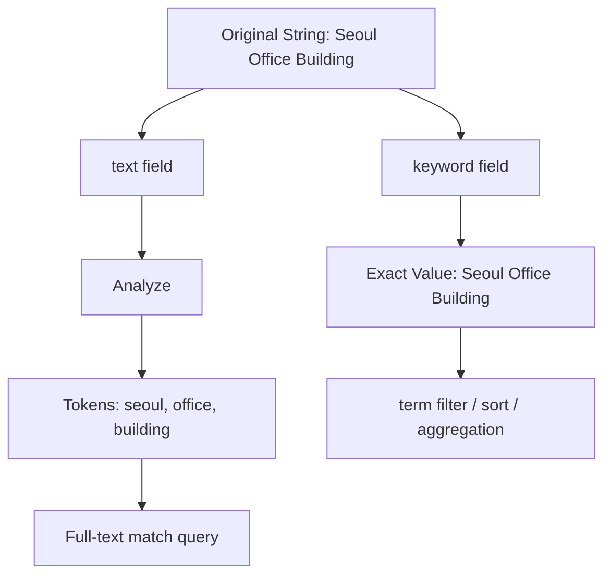

---

## 6. Index Analysis Settings

Analyzers are defined in index settings and referenced by mappings.

### Basic lowercase + ASCII folding analyzer

```json
PUT articles-v1
{
  "settings": {
    "analysis": {
      "analyzer": {
        "folding_text_analyzer": {
          "type": "custom",
          "tokenizer": "standard",
          "filter": ["lowercase", "asciifolding"]
        }
      },
      "normalizer": {
        "lowercase_keyword_normalizer": {
          "type": "custom",
          "filter": ["lowercase", "asciifolding"]
        }
      }
    }
  },
  "mappings": {
    "properties": {
      "title": {
        "type": "text",
        "analyzer": "folding_text_analyzer",
        "fields": {
          "keyword": {
            "type": "keyword",
            "normalizer": "lowercase_keyword_normalizer"
          }
        }
      }
    }
  }
}
```

### Search-as-you-type with edge n-gram

Use this for prefix search such as `seo` → `seoul`.

```json
PUT autocomplete-v1
{
  "settings": {
    "analysis": {
      "analyzer": {
        "autocomplete_index": {
          "type": "custom",
          "tokenizer": "autocomplete_tokenizer",
          "filter": ["lowercase"]
        },
        "autocomplete_search": {
          "type": "custom",
          "tokenizer": "standard",
          "filter": ["lowercase"]
        }
      },
      "tokenizer": {
        "autocomplete_tokenizer": {
          "type": "edge_ngram",
          "min_gram": 2,
          "max_gram": 20,
          "token_chars": ["letter", "digit"]
        }
      }
    }
  },
  "mappings": {
    "properties": {
      "name": {
        "type": "text",
        "analyzer": "autocomplete_index",
        "search_analyzer": "autocomplete_search",
        "fields": {
          "keyword": { "type": "keyword", "ignore_above": 256 }
        }
      }
    }
  }
}
```

### N-gram for partial matching

Use n-gram carefully. It can increase index size significantly.

```json
PUT partial-match-v1
{
  "settings": {
    "analysis": {
      "tokenizer": {
        "custom_ngram_tokenizer": {
          "type": "ngram",
          "min_gram": 2,
          "max_gram": 3,
          "token_chars": ["letter", "digit"]
        }
      },
      "analyzer": {
        "custom_ngram_analyzer": {
          "type": "custom",
          "tokenizer": "custom_ngram_tokenizer",
          "filter": ["lowercase"]
        }
      }
    }
  },
  "mappings": {
    "properties": {
      "search_text": {
        "type": "text",
        "analyzer": "custom_ngram_analyzer",
        "search_analyzer": "standard"
      }
    }
  }
}
```

### Korean text with Nori analyzer

For Korean search, consider the official Nori analysis plugin. Availability depends on your deployment type and plugin support.

```json
PUT korean-properties-v1
{
  "settings": {
    "analysis": {
      "analyzer": {
        "korean_nori": {
          "type": "custom",
          "tokenizer": "nori_tokenizer",
          "filter": ["nori_part_of_speech", "lowercase"]
        }
      }
    }
  },
  "mappings": {
    "properties": {
      "address": {
        "type": "text",
        "analyzer": "korean_nori",
        "fields": {
          "keyword": { "type": "keyword", "ignore_above": 512 }
        }
      }
    }
  }
}
```

### Mermaid: analyzer pipeline

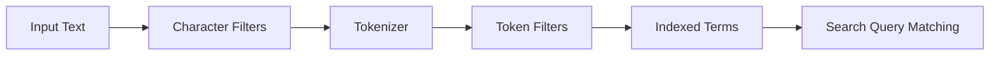

---

## 7. Dynamic Mapping

Dynamic mapping means Elasticsearch automatically detects and adds fields when new documents are indexed.

### Default dynamic mapping example

```json
POST dynamic-test/_doc/1
{
  "name": "Ryan",
  "age": 45,
  "active": true,
  "created_at": "2026-06-10T09:00:00+09:00"
}
```

Elasticsearch may automatically map fields as something like:

```json
{
  "name": { "type": "text", "fields": { "keyword": { "type": "keyword" } } },
  "age": { "type": "long" },
  "active": { "type": "boolean" },
  "created_at": { "type": "date" }
}
```

### Dynamic modes

| `dynamic` value | Behavior | Recommended use |
|---|---|---|
| `true` | new fields are added automatically | early prototyping |
| `false` | unknown fields are ignored for indexing but remain in `_source` | controlled schema with flexible source payload |
| `strict` | unknown fields reject the document | production critical indices |
| `runtime` | new fields become runtime fields | exploratory data, lower indexing cost |

### Strict mapping example

```json
PUT strict-users-v1
{
  "mappings": {
    "dynamic": "strict",
    "properties": {
      "user_id": { "type": "keyword" },
      "name": { "type": "text" }
    }
  }
}
```

This document succeeds:

```json
POST strict-users-v1/_doc/1
{
  "user_id": "u-1",
  "name": "Ryan"
}
```

This document fails because `unknown_field` is not mapped:

```json
POST strict-users-v1/_doc/2
{
  "user_id": "u-2",
  "name": "Alex",
  "unknown_field": "not allowed"
}
```

### Dynamic false example

```json
PUT flexible-source-v1
{
  "mappings": {
    "dynamic": false,
    "properties": {
      "id": { "type": "keyword" },
      "title": { "type": "text" }
    }
  }
}
```

Unknown fields remain in `_source`, but are not searchable unless explicitly mapped later and reindexed.

---

## 8. Dynamic Templates

Dynamic templates let you control how dynamically discovered fields are mapped.

### Example: map all `*_id` fields as keyword

```json
PUT dynamic-template-v1
{
  "mappings": {
    "dynamic_templates": [
      {
        "ids_as_keyword": {
          "match": "*_id",
          "mapping": {
            "type": "keyword"
          }
        }
      }
    ]
  }
}
```

If you index:

```json
POST dynamic-template-v1/_doc/1
{
  "user_id": "123",
  "order_id": "A-999"
}
```

Then both `user_id` and `order_id` become `keyword` fields.

### Example: map string fields as keyword only

Useful for logs or structured data where full-text search is not needed.

```json
PUT logs-structured-v1
{
  "mappings": {
    "dynamic_templates": [
      {
        "strings_as_keywords": {
          "match_mapping_type": "string",
          "mapping": {
            "type": "keyword",
            "ignore_above": 1024
          }
        }
      }
    ]
  }
}
```

### Example: map unknown objects as flattened

```json
PUT flexible-metadata-v1
{
  "mappings": {
    "dynamic_templates": [
      {
        "metadata_objects_as_flattened": {
          "path_match": "metadata.*",
          "match_mapping_type": "object",
          "mapping": {
            "type": "flattened"
          }
        }
      }
    ],
    "properties": {
      "metadata": {
        "type": "object",
        "dynamic": true
      }
    }
  }
}
```

### Mermaid: dynamic mapping decision

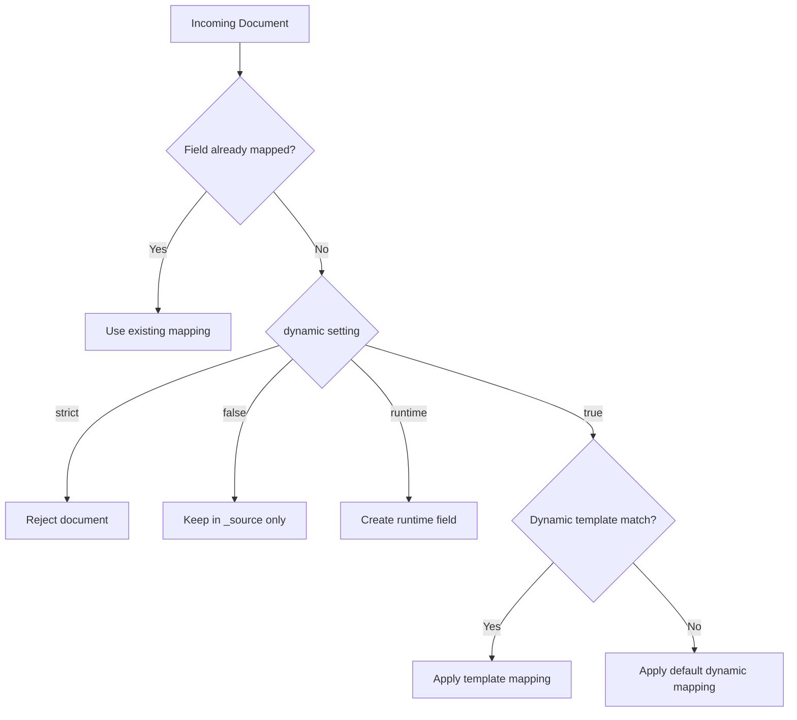

---

## 9. Objects, Nested, Flattened

### Object field

Use `object` for normal JSON objects.

```json
PUT users-v1
{
  "mappings": {
    "properties": {
      "profile": {
        "properties": {
          "first_name": { "type": "keyword" },
          "last_name": { "type": "keyword" }
        }
      }
    }
  }
}
```

### Problem with arrays of objects

Elasticsearch flattens object fields internally. This can lose the association between fields in arrays of objects.

Example document:

```json
{
  "owners": [
    { "name": "Alice", "role": "seller" },
    { "name": "Bob", "role": "buyer" }
  ]
}
```

A normal object mapping can incorrectly match:

- `owners.name = Alice`
- `owners.role = buyer`

Because the association between `Alice` and `seller` can be lost.

### Nested field

Use `nested` when each object in an array must be queried independently.

```json
PUT properties-with-owners-v1
{
  "mappings": {
    "properties": {
      "owners": {
        "type": "nested",
        "properties": {
          "name": { "type": "keyword" },
          "role": { "type": "keyword" },
          "share_percent": { "type": "scaled_float", "scaling_factor": 100 }
        }
      }
    }
  }
}
```

Nested query:

```json
GET properties-with-owners-v1/_search
{
  "query": {
    "nested": {
      "path": "owners",
      "query": {
        "bool": {
          "must": [
            { "term": { "owners.name": "Alice" } },
            { "term": { "owners.role": "seller" } }
          ]
        }
      }
    }
  }
}
```

### Flattened field

Use `flattened` for arbitrary key-value objects where you do not want mapping explosion.

```json
PUT products-with-attributes-v1
{
  "mappings": {
    "properties": {
      "attributes": {
        "type": "flattened"
      }
    }
  }
}
```

Example document:

```json
POST products-with-attributes-v1/_doc/1
{
  "attributes": {
    "floor": "12",
    "parking": "available",
    "custom_owner_note": "near station"
  }
}
```

Query:

```json
GET products-with-attributes-v1/_search
{
  "query": {
    "term": {
      "attributes.parking": "available"
    }
  }
}
```

### Mermaid: object vs nested

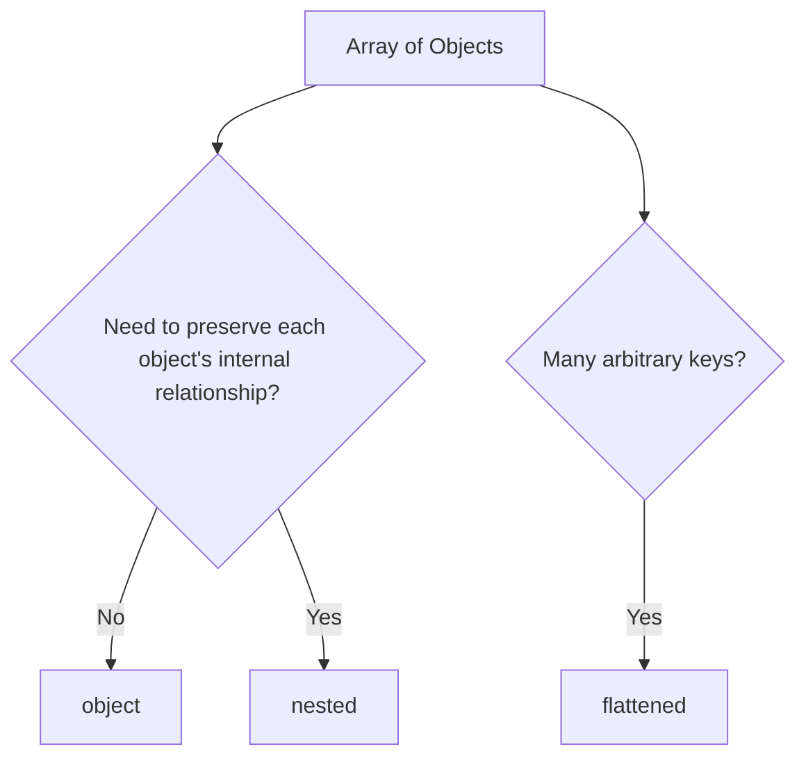

---

## 10. Geo, IP, Date, Range, Completion, Vector

### `geo_point`

Use `geo_point` for latitude/longitude.

```json
PUT places-v1
{
  "mappings": {
    "properties": {
      "name": { "type": "text" },
      "location": { "type": "geo_point" }
    }
  }
}
```

Index document:

```json
POST places-v1/_doc/1
{
  "name": "Gangnam Station",
  "location": {
    "lat": 37.4979,
    "lon": 127.0276
  }
}
```

Distance query:

```json
GET places-v1/_search
{
  "query": {
    "geo_distance": {
      "distance": "1km",
      "location": {
        "lat": 37.4979,
        "lon": 127.0276
      }
    }
  }
}
```

### `ip`

```json
PUT access-logs-v1
{
  "mappings": {
    "properties": {
      "client_ip": { "type": "ip" },
      "path": { "type": "keyword" }
    }
  }
}
```

### Range fields

```json
PUT availability-v1
{
  "mappings": {
    "properties": {
      "available_price": { "type": "integer_range" },
      "available_date": { "type": "date_range" }
    }
  }
}
```

Example document:

```json
POST availability-v1/_doc/1
{
  "available_price": { "gte": 100000, "lte": 300000 },
  "available_date": { "gte": "2026-06-01", "lte": "2026-06-30" }
}
```

### Completion suggester

```json
PUT suggest-v1
{
  "mappings": {
    "properties": {
      "name": { "type": "text" },
      "name_suggest": { "type": "completion" }
    }
  }
}
```

Index document:

```json
POST suggest-v1/_doc/1
{
  "name": "Seoul Station Office",
  "name_suggest": {
    "input": ["Seoul Station Office", "Station Office"]
  }
}
```

Suggest query:

```json
GET suggest-v1/_search
{
  "suggest": {
    "name-suggest": {
      "prefix": "seo",
      "completion": {
        "field": "name_suggest"
      }
    }
  }
}
```

### `dense_vector`

Use `dense_vector` for embeddings and kNN search.

```json
PUT property-vectors-v1
{
  "mappings": {
    "properties": {
      "title": { "type": "text" },
      "embedding": {
        "type": "dense_vector",
        "dims": 384,
        "similarity": "cosine"
      }
    }
  }
}
```

kNN search example:

```json
GET property-vectors-v1/_search
{
  "knn": {
    "field": "embedding",
    "query_vector": [0.12, -0.04, 0.98],
    "k": 10,
    "num_candidates": 100
  },
  "fields": ["title"]
}
```

### Mermaid: vector search flow

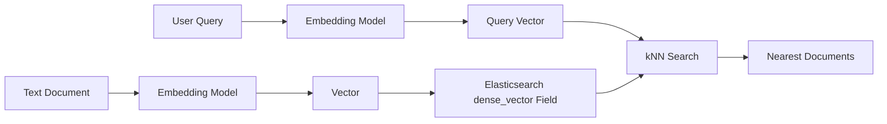

---

## 11. Common Mapping Parameters

### `index`

Whether the field is searchable.

```json
"internal_note": {
  "type": "keyword",
  "index": false
}
```

The field is stored in `_source`, but cannot be searched.

### `doc_values`

`doc_values` are columnar structures used for sorting, aggregations, and scripting.

```json
"description": {
  "type": "keyword",
  "doc_values": false
}
```

Usually keep defaults unless you know the field will never be sorted or aggregated.

### `ignore_above`

Prevents indexing very long keyword values.

```json
"raw_url": {
  "type": "keyword",
  "ignore_above": 2048
}
```

### `null_value`

Index a replacement value when a field is explicitly `null`.

```json
"status": {
  "type": "keyword",
  "null_value": "UNKNOWN"
}
```

### `copy_to`

Copy multiple fields into one searchable field.

```json
PUT searchable-users-v1
{
  "mappings": {
    "properties": {
      "first_name": { "type": "text", "copy_to": "full_text" },
      "last_name": { "type": "text", "copy_to": "full_text" },
      "email": { "type": "keyword", "copy_to": "full_text" },
      "full_text": { "type": "text" }
    }
  }
}
```

### `enabled`

Disable parsing for an object field.

```json
"raw_payload": {
  "type": "object",
  "enabled": false
}
```

Use this when you want to store raw JSON but do not want Elasticsearch to parse/index it.

### `eager_global_ordinals`

Can improve aggregation performance on high-use keyword fields at the cost of refresh overhead.

```json
"category": {
  "type": "keyword",
  "eager_global_ordinals": true
}
```

---

## 12. Index Templates and Component Templates

Templates are essential when you create multiple indices with the same schema.

Use cases:

- time-based logs: `logs-2026.06.10`, `logs-2026.06.11`;
- versioned application indices: `properties-v1`, `properties-v2`;
- data streams;
- shared analyzers across many indices.

### Component template: settings

```json
PUT _component_template/ct-properties-settings
{
  "template": {
    "settings": {
      "number_of_shards": 1,
      "number_of_replicas": 1,
      "refresh_interval": "1s",
      "analysis": {
        "normalizer": {
          "lowercase_keyword": {
            "type": "custom",
            "filter": ["lowercase", "asciifolding"]
          }
        }
      }
    }
  }
}
```

### Component template: mappings

```json
PUT _component_template/ct-properties-mappings
{
  "template": {
    "mappings": {
      "dynamic": "strict",
      "properties": {
        "id": { "type": "keyword" },
        "title": {
          "type": "text",
          "fields": {
            "keyword": {
              "type": "keyword",
              "ignore_above": 256,
              "normalizer": "lowercase_keyword"
            }
          }
        },
        "created_at": { "type": "date" }
      }
    }
  }
}
```

### Index template

```json
PUT _index_template/it-properties
{
  "index_patterns": ["properties-*"] ,
  "priority": 200,
  "composed_of": [
    "ct-properties-settings",
    "ct-properties-mappings"
  ],
  "template": {
    "aliases": {
      "properties-read": {}
    }
  }
}
```

### Mermaid: composable templates

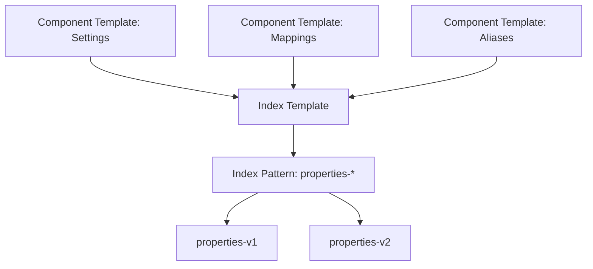

---

## 13. Aliases, Reindexing, and Zero-downtime Migration

Use aliases to avoid hardcoding physical index names in your application.

Recommended pattern:

- `properties-read` → index used for search;
- `properties-write` → index used for writes;
- physical index: `properties-v1`, `properties-v2`, etc.

### Create v1 with aliases

```json
PUT properties-v1
{
  "aliases": {
    "properties-read": {},
    "properties-write": { "is_write_index": true }
  },
  "mappings": {
    "properties": {
      "id": { "type": "keyword" },
      "title": { "type": "text" }
    }
  }
}
```

### Create v2 with improved mapping

```json
PUT properties-v2
{
  "mappings": {
    "properties": {
      "id": { "type": "keyword" },
      "title": {
        "type": "text",
        "fields": {
          "keyword": { "type": "keyword", "ignore_above": 256 }
        }
      },
      "price_krw": { "type": "long" }
    }
  }
}
```

### Reindex

```json
POST _reindex
{
  "source": {
    "index": "properties-v1"
  },
  "dest": {
    "index": "properties-v2"
  }
}
```

### Switch aliases atomically

```json
POST _aliases
{
  "actions": [
    { "remove": { "index": "properties-v1", "alias": "properties-read" } },
    { "remove": { "index": "properties-v1", "alias": "properties-write" } },
    { "add": { "index": "properties-v2", "alias": "properties-read" } },
    { "add": { "index": "properties-v2", "alias": "properties-write", "is_write_index": true } }
  ]
}
```

### Mermaid: alias migration

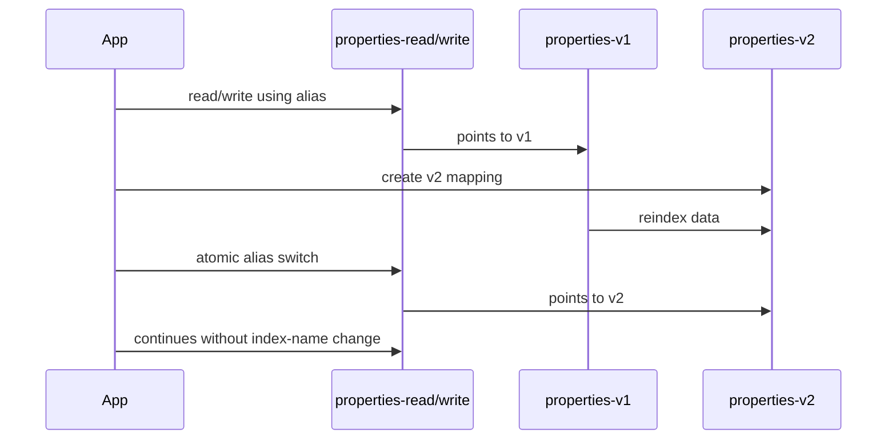

---

## 14. Full Example: Real Estate Property Search Index

This example is designed for a property listing/search system.

Features:

- Korean address search;
- exact filters by property type/status;
- price and area range filters;
- location search using `geo_point`;
- owner array using `nested`;
- flexible attributes using `flattened`;
- combined search field using `copy_to`;
- autocomplete field;
- strict schema for production safety.

```json
PUT properties-v1
{
  "settings": {
    "number_of_shards": 1,
    "number_of_replicas": 1,
    "refresh_interval": "1s",
    "analysis": {
      "normalizer": {
        "lowercase_keyword": {
          "type": "custom",
          "filter": ["lowercase", "asciifolding"]
        }
      },
      "tokenizer": {
        "autocomplete_tokenizer": {
          "type": "edge_ngram",
          "min_gram": 2,
          "max_gram": 20,
          "token_chars": ["letter", "digit"]
        }
      },
      "analyzer": {
        "autocomplete_index": {
          "type": "custom",
          "tokenizer": "autocomplete_tokenizer",
          "filter": ["lowercase"]
        },
        "autocomplete_search": {
          "type": "custom",
          "tokenizer": "standard",
          "filter": ["lowercase"]
        },
        "address_search": {
          "type": "custom",
          "tokenizer": "standard",
          "filter": ["lowercase"]
        }
      }
    }
  },
  "aliases": {
    "properties-read": {},
    "properties-write": { "is_write_index": true }
  },
  "mappings": {
    "dynamic": "strict",
    "properties": {
      "obj_id": { "type": "keyword" },
      "obj_name": {
        "type": "text",
        "analyzer": "address_search",
        "copy_to": "all_text",
        "fields": {
          "keyword": {
            "type": "keyword",
            "ignore_above": 256,
            "normalizer": "lowercase_keyword"
          },
          "autocomplete": {
            "type": "text",
            "analyzer": "autocomplete_index",
            "search_analyzer": "autocomplete_search"
          }
        }
      },
      "obj_addr": {
        "type": "text",
        "analyzer": "address_search",
        "copy_to": "all_text",
        "fields": {
          "keyword": { "type": "keyword", "ignore_above": 512 }
        }
      },
      "obj_type": { "type": "keyword" },
      "status": { "type": "keyword" },
      "sale_status": { "type": "keyword" },
      "price_krw": { "type": "long" },
      "area_m2": { "type": "scaled_float", "scaling_factor": 100 },
      "total_area_m2": { "type": "scaled_float", "scaling_factor": 100 },
      "yield_rate": { "type": "scaled_float", "scaling_factor": 10000 },
      "built_year": { "type": "short" },
      "location": { "type": "geo_point" },
      "created_at": { "type": "date" },
      "updated_at": { "type": "date" },
      "owners": {
        "type": "nested",
        "properties": {
          "owner_name": { "type": "keyword", "ignore_above": 128 },
          "owner_type": { "type": "keyword" },
          "share_percent": { "type": "scaled_float", "scaling_factor": 100 }
        }
      },
      "attributes": { "type": "flattened" },
      "all_text": { "type": "text", "analyzer": "address_search" }
    }
  }
}
```

### Example document

```json
POST properties-write/_doc/obj-1001
{
  "obj_id": "obj-1001",
  "obj_name": "Gangnam Office Building",
  "obj_addr": "서울특별시 강남구 테헤란로 123",
  "obj_type": "office",
  "status": "active",
  "sale_status": "for_sale",
  "price_krw": 12500000000,
  "area_m2": 320.55,
  "total_area_m2": 1200.75,
  "yield_rate": 4.52,
  "built_year": 2008,
  "location": { "lat": 37.501, "lon": 127.039 },
  "created_at": "2026-06-10T09:00:00+09:00",
  "updated_at": "2026-06-10T09:00:00+09:00",
  "owners": [
    { "owner_name": "Kim", "owner_type": "individual", "share_percent": 50.0 },
    { "owner_name": "Lee", "owner_type": "individual", "share_percent": 50.0 }
  ],
  "attributes": {
    "parking": "available",
    "elevator": "yes",
    "near_subway": "yes"
  }
}
```

### Example search

```json
GET properties-read/_search
{
  "query": {
    "bool": {
      "must": [
        {
          "multi_match": {
            "query": "강남 오피스",
            "fields": ["obj_name^3", "obj_addr^2", "all_text"]
          }
        }
      ],
      "filter": [
        { "term": { "obj_type": "office" } },
        { "term": { "sale_status": "for_sale" } },
        { "range": { "price_krw": { "gte": 1000000000, "lte": 20000000000 } } },
        {
          "geo_distance": {
            "distance": "3km",
            "location": { "lat": 37.501, "lon": 127.039 }
          }
        }
      ]
    }
  },
  "sort": [
    { "updated_at": "desc" },
    { "price_krw": "asc" }
  ],
  "aggs": {
    "by_type": {
      "terms": { "field": "obj_type" }
    }
  }
}
```

### Mermaid: property search architecture

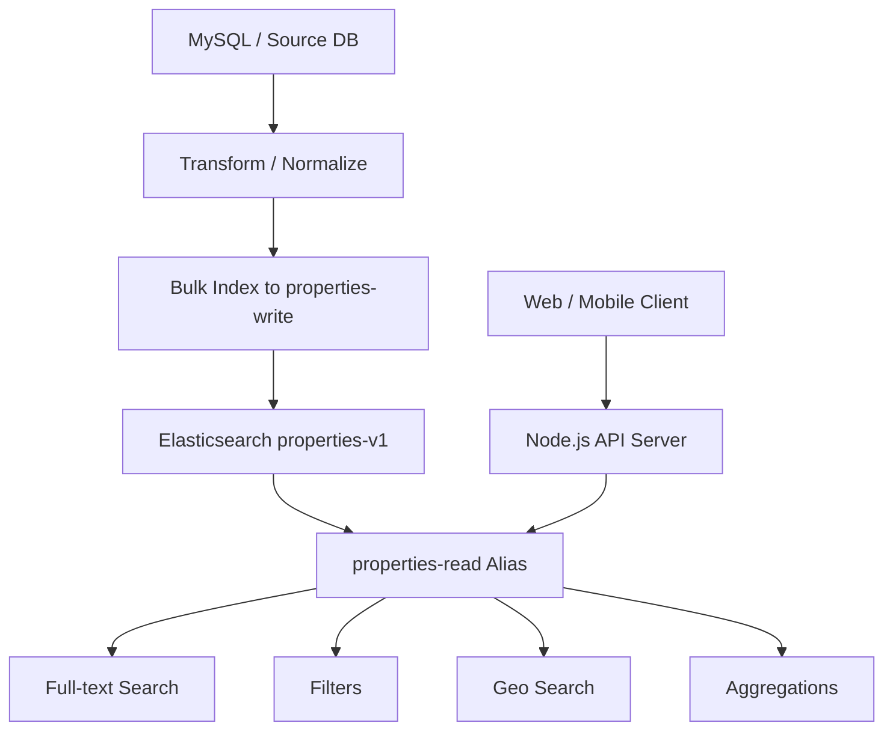

---

## 15. Node.js: Managing Indices

### Install

```bash
npm install @elastic/elasticsearch
```

### Create client

```js
// es-client.js
import { Client } from '@elastic/elasticsearch';

export const es = new Client({
  node: process.env.ELASTICSEARCH_URL,
  auth: {
    apiKey: process.env.ELASTICSEARCH_API_KEY
  }
});
```

For local development with username/password:

```js
import { Client } from '@elastic/elasticsearch';

export const es = new Client({
  node: 'http://localhost:9200',
  auth: {
    username: 'elastic',
    password: process.env.ELASTIC_PASSWORD
  }
});
```

### Create an index with settings and mappings

```js
// create-properties-index.js
import { es } from './es-client.js';

const index = 'properties-v1';

async function main() {
  const exists = await es.indices.exists({ index });

  if (exists) {
    console.log(`${index} already exists`);
    return;
  }

  await es.indices.create({
    index,
    settings: {
      number_of_shards: 1,
      number_of_replicas: 1,
      refresh_interval: '1s',
      analysis: {
        normalizer: {
          lowercase_keyword: {
            type: 'custom',
            filter: ['lowercase', 'asciifolding']
          }
        }
      }
    },
    mappings: {
      dynamic: 'strict',
      properties: {
        obj_id: { type: 'keyword' },
        obj_name: {
          type: 'text',
          fields: {
            keyword: {
              type: 'keyword',
              ignore_above: 256,
              normalizer: 'lowercase_keyword'
            }
          }
        },
        price_krw: { type: 'long' },
        location: { type: 'geo_point' },
        created_at: { type: 'date' }
      }
    },
    aliases: {
      'properties-read': {},
      'properties-write': { is_write_index: true }
    }
  });

  console.log(`created ${index}`);
}

main().catch((err) => {
  console.error(err);
  process.exit(1);
});
```

### Get mapping

```js
import { es } from './es-client.js';

const mapping = await es.indices.getMapping({
  index: 'properties-v1'
});

console.dir(mapping, { depth: null });
```

### Get settings

```js
import { es } from './es-client.js';

const settings = await es.indices.getSettings({
  index: 'properties-v1'
});

console.dir(settings, { depth: null });
```

### Add a new field with putMapping

```js
import { es } from './es-client.js';

await es.indices.putMapping({
  index: 'properties-v1',
  properties: {
    updated_at: { type: 'date' },
    sale_status: { type: 'keyword' }
  }
});
```

Do not use this to change existing field types. Create a new index and reindex instead.

### Delete index

```js
import { es } from './es-client.js';

await es.indices.delete({
  index: 'properties-v1'
});
```

### Mermaid: Node.js index management

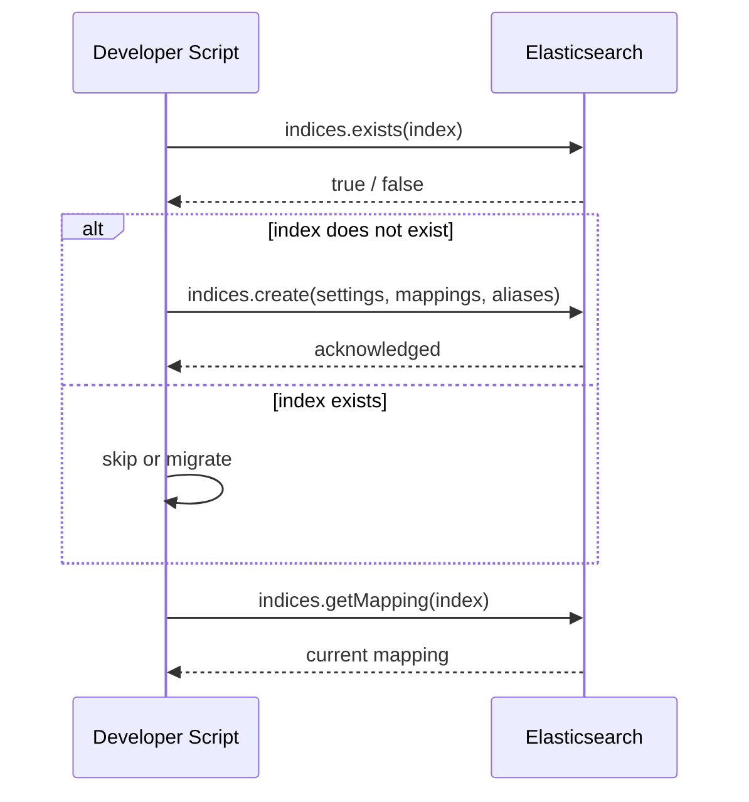

---

## 16. Node.js: Indexing and Searching Documents

### Index one document

```js
import { es } from './es-client.js';

await es.index({
  index: 'properties-write',
  id: 'obj-1001',
  document: {
    obj_id: 'obj-1001',
    obj_name: 'Gangnam Office Building',
    price_krw: 12500000000,
    location: { lat: 37.501, lon: 127.039 },
    created_at: new Date().toISOString()
  },
  refresh: 'wait_for'
});
```

### Bulk index documents

```js
import { es } from './es-client.js';

const docs = [
  {
    obj_id: 'obj-1001',
    obj_name: 'Gangnam Office Building',
    price_krw: 12500000000,
    location: { lat: 37.501, lon: 127.039 },
    created_at: '2026-06-10T09:00:00+09:00'
  },
  {
    obj_id: 'obj-1002',
    obj_name: 'Seoul Station Retail',
    price_krw: 7800000000,
    location: { lat: 37.556, lon: 126.972 },
    created_at: '2026-06-10T09:10:00+09:00'
  }
];

const operations = docs.flatMap((doc) => [
  { index: { _index: 'properties-write', _id: doc.obj_id } },
  doc
]);

const result = await es.bulk({
  refresh: 'wait_for',
  operations
});

if (result.errors) {
  const erroredDocuments = [];

  result.items.forEach((action, i) => {
    const operation = Object.keys(action)[0];
    if (action[operation].error) {
      erroredDocuments.push({
        status: action[operation].status,
        error: action[operation].error,
        document: docs[i]
      });
    }
  });

  console.error(JSON.stringify(erroredDocuments, null, 2));
}
```

### Search with text query and filters

```js
import { es } from './es-client.js';

const response = await es.search({
  index: 'properties-read',
  query: {
    bool: {
      must: [
        {
          match: {
            obj_name: 'office building'
          }
        }
      ],
      filter: [
        { range: { price_krw: { lte: 15000000000 } } }
      ]
    }
  },
  sort: [
    { price_krw: 'asc' }
  ]
});

console.log(response.hits.hits.map((hit) => hit._source));
```

### Search by geo distance

```js
import { es } from './es-client.js';

const response = await es.search({
  index: 'properties-read',
  query: {
    bool: {
      filter: [
        {
          geo_distance: {
            distance: '2km',
            location: {
              lat: 37.501,
              lon: 127.039
            }
          }
        }
      ]
    }
  }
});

console.log(response.hits.hits);
```

### Nested query in Node.js

```js
import { es } from './es-client.js';

const response = await es.search({
  index: 'properties-read',
  query: {
    nested: {
      path: 'owners',
      query: {
        bool: {
          must: [
            { term: { 'owners.owner_name': 'Kim' } },
            { term: { 'owners.owner_type': 'individual' } }
          ]
        }
      },
      inner_hits: {}
    }
  }
});

console.log(response.hits.hits);
```

### kNN vector search in Node.js

```js
import { es } from './es-client.js';

const queryVector = [0.12, -0.04, 0.98]; // use the correct dimension for your mapping

const response = await es.search({
  index: 'property-vectors-v1',
  knn: {
    field: 'embedding',
    query_vector: queryVector,
    k: 10,
    num_candidates: 100
  },
  fields: ['title']
});

console.log(response.hits.hits);
```

### Reindex with Node.js

```js
import { es } from './es-client.js';

await es.reindex({
  wait_for_completion: true,
  source: {
    index: 'properties-v1'
  },
  dest: {
    index: 'properties-v2'
  }
});
```

### Atomic alias switch with Node.js

```js
import { es } from './es-client.js';

await es.indices.updateAliases({
  actions: [
    { remove: { index: 'properties-v1', alias: 'properties-read' } },
    { remove: { index: 'properties-v1', alias: 'properties-write' } },
    { add: { index: 'properties-v2', alias: 'properties-read' } },
    { add: { index: 'properties-v2', alias: 'properties-write', is_write_index: true } }
  ]
});
```

---

## 17. Testing Mappings and Analyzers

### Check analyzer output

```json
GET properties-v1/_analyze
{
  "analyzer": "standard",
  "text": "Seoul Office Building"
}
```

### Check custom analyzer

```json
GET autocomplete-v1/_analyze
{
  "analyzer": "autocomplete_index",
  "text": "Gangnam"
}
```

Expected style of tokens:

```text
ga
gan
gang
gangn
gangna
gangnam
```

### Validate mapping

```json
GET properties-v1/_mapping
```

### Validate field capabilities

```json
GET properties-v1/_field_caps?fields=price_krw,obj_name,obj_name.keyword
```

### Explain a search result

```json
GET properties-read/_explain/obj-1001
{
  "query": {
    "match": {
      "obj_name": "office"
    }
  }
}
```

### Profile a query

```json
GET properties-read/_search
{
  "profile": true,
  "query": {
    "match": {
      "obj_name": "office"
    }
  }
}
```

---

## 18. Production Checklist

### Before creating the index

- [ ] Identify search use cases.
- [ ] Identify filter/sort/aggregation fields.
- [ ] Decide `text` vs `keyword` for every string field.
- [ ] Add `.keyword` multi-fields only where needed.
- [ ] Choose numeric types carefully.
- [ ] Use `long` or `scaled_float` for money.
- [ ] Define date formats.
- [ ] Decide whether dynamic mapping should be `strict`, `false`, `true`, or `runtime`.
- [ ] Add analyzers before creating the index.
- [ ] Use aliases instead of physical index names in application code.

### Before production indexing

- [ ] Test `_analyze` for important text fields.
- [ ] Index realistic sample documents.
- [ ] Test match queries.
- [ ] Test filters.
- [ ] Test sorting.
- [ ] Test aggregations.
- [ ] Test geo queries if used.
- [ ] Test nested queries if used.
- [ ] Test error behavior with unknown fields if using `dynamic: strict`.

### For long-term maintenance

- [ ] Version index names: `properties-v1`, `properties-v2`.
- [ ] Use read/write aliases.
- [ ] Reindex when field types need to change.
- [ ] Keep mapping JSON in source control.
- [ ] Keep migration scripts in source control.
- [ ] Avoid uncontrolled dynamic fields.
- [ ] Monitor mapping explosion.
- [ ] Keep bulk indexing scripts idempotent.

---

## 19. Common Mistakes

### Mistake 1: using `text` for IDs

Bad:

```json
"user_id": { "type": "text" }
```

Good:

```json
"user_id": { "type": "keyword" }
```

### Mistake 2: sorting on a `text` field

Bad:

```json
"sort": [{ "title": "asc" }]
```

Good:

```json
"sort": [{ "title.keyword": "asc" }]
```

### Mistake 3: relying on dynamic mapping in production

Dynamic mapping is convenient, but production search behavior should be intentional.

Prefer:

```json
"dynamic": "strict"
```

or:

```json
"dynamic": false
```

### Mistake 4: changing field type in-place

Bad idea:

```json
PUT my-index/_mapping
{
  "properties": {
    "price": { "type": "long" }
  }
}
```

If `price` already exists as `keyword`, create a new index and reindex.

### Mistake 5: using `nested` everywhere

`nested` is powerful but heavier than normal object fields. Use it only when each object in an array must be queried independently.

### Mistake 6: n-gram everything

N-grams can increase index size and indexing cost. Use edge n-gram for prefix autocomplete, and reserve full n-gram for cases that truly need partial matching.

### Mistake 7: mapping arbitrary metadata as normal object fields

Bad for unpredictable keys:

```json
"metadata": { "type": "object", "dynamic": true }
```

Better:

```json
"metadata": { "type": "flattened" }
```

### Mistake 8: indexing vector fields without understanding cost

Vector indexing can be expensive. Test ingest speed, memory usage, recall quality, and query latency before committing to a production design.

---

## 20. References

Official Elastic documentation used as the basis for this guide:

- Elasticsearch field data types: <https://www.elastic.co/docs/reference/elasticsearch/mapping-reference/field-data-types>
- Elasticsearch mapping overview: <https://www.elastic.co/docs/manage-data/data-store/mapping>
- Dynamic mapping: <https://www.elastic.co/docs/manage-data/data-store/mapping/dynamic-mapping>
- Dynamic templates: <https://www.elastic.co/docs/manage-data/data-store/mapping/dynamic-templates>
- Index templates: <https://www.elastic.co/docs/manage-data/data-store/templates>
- Mapping parameters: <https://www.elastic.co/docs/reference/elasticsearch/mapping-reference/mapping-parameters>
- Text field type: <https://www.elastic.co/docs/reference/elasticsearch/mapping-reference/text>
- Keyword field type: <https://www.elastic.co/docs/reference/elasticsearch/mapping-reference/keyword>
- Multi-fields: <https://www.elastic.co/docs/reference/elasticsearch/mapping-reference/multi-fields>
- Nested field type: <https://www.elastic.co/docs/reference/elasticsearch/mapping-reference/nested>
- Dense vector field type: <https://www.elastic.co/docs/reference/elasticsearch/mapping-reference/dense-vector>
- Edge n-gram tokenizer: <https://www.elastic.co/docs/reference/text-analysis/analysis-edgengram-tokenizer>
- N-gram tokenizer: <https://www.elastic.co/docs/reference/text-analysis/analysis-ngram-tokenizer>
- Korean Nori analysis plugin: <https://www.elastic.co/docs/reference/elasticsearch/plugins/analysis-nori>
- Official Elasticsearch JavaScript client getting started: <https://www.elastic.co/docs/reference/elasticsearch/clients/javascript/getting-started>
- Official Elasticsearch JavaScript client bulk examples: <https://www.elastic.co/docs/reference/elasticsearch/clients/javascript/bulk_examples>

---

## Appendix A: Minimal Mapping Starter

```json
PUT app-index-v1
{
  "settings": {
    "number_of_shards": 1,
    "number_of_replicas": 1
  },
  "aliases": {
    "app-index-read": {},
    "app-index-write": { "is_write_index": true }
  },
  "mappings": {
    "dynamic": "strict",
    "properties": {
      "id": { "type": "keyword" },
      "title": {
        "type": "text",
        "fields": {
          "keyword": { "type": "keyword", "ignore_above": 256 }
        }
      },
      "status": { "type": "keyword" },
      "created_at": { "type": "date" },
      "updated_at": { "type": "date" }
    }
  }
}
```

## Appendix B: Minimal Node.js Starter

```js
import { Client } from '@elastic/elasticsearch';

const es = new Client({
  node: process.env.ELASTICSEARCH_URL,
  auth: { apiKey: process.env.ELASTICSEARCH_API_KEY }
});

async function main() {
  await es.index({
    index: 'app-index-write',
    id: '1',
    document: {
      id: '1',
      title: 'Hello Elasticsearch',
      status: 'active',
      created_at: new Date().toISOString(),
      updated_at: new Date().toISOString()
    },
    refresh: 'wait_for'
  });

  const result = await es.search({
    index: 'app-index-read',
    query: {
      match: { title: 'elasticsearch' }
    }
  });

  console.log(result.hits.hits);
}

main().catch(console.error);
```
